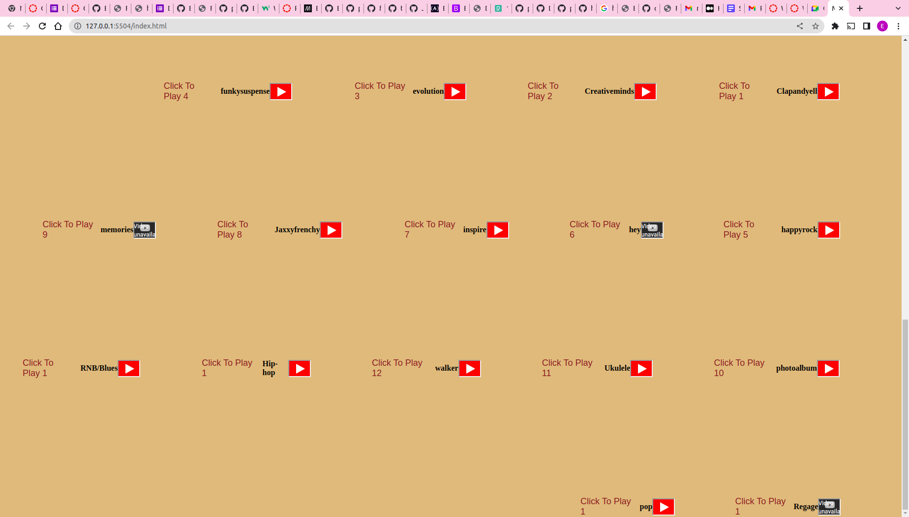

# MUSIC API

## Discription

This an application that enables a user to interact with music streams from youtube audio and play it on the DOM.

## Built with
This application was built with the following technologies: 

* HTML
* CSS
* JavaScript
* JSON

   

## Running The Live Hosted Application

* open this [link](https://ernesth1.github.io/Project-1/) on your browser to access the live web application
* you can also follow the link on the right side of the repository below the discription
* on the browser you will need to enter your credentials that is user name and password to access the music. 
* search for your music and click on the play icon to listen to your music.

## Installation

* In order for you to use the content on this repository ensure you have the following:

A computer that runs on either of the following; (Windows 7+, Linux, Mac OS)
nodejs 9.0+

* To intall this challengeor use in your computer you can either ``clone`` or ``fork`` the project
Open a terminal / command line interface on your computer

* Clone the repo by using the following to create a copy on your local machine:

 `` git clone https://github.com/ErnestH1/Project-1``
* Change directory to the repository folder:

 `` cd /home/music..``
 
*  Open it in Visual Studio Code

  ``code .``

## Usage

to use and test the code you can run

``npm index.js ``

``npm start``

* To get the backend started you need to run

  ``json-server --watch db.json``

 * you can test your  server by visiting this route in the browser:
 
  from n-point ``https://api.npoint.io/9aec623c6586cd4c1b04/music/``  or Genre ``https://api.npoint.io/2df136e90bcc6ac40df8/Genere/``
  
* Find the index.html  to view on browser, right-click on it, and choose Open with from the menu. You will see a full list of apps that you can use to run your file. Your default browser will be at the top of the list.
* Select Google Chrome from the list, and view your file in the browser.
* on the browser, enter log-in details and click log-in button

## The UI use

* The landing page starts with a log-in section where the user enters his/her credentials to be allowed to access the application

* To search for genre enter genre type into the search box and click the search icon

* To get results from playlist scroll through the playlist and click to play 

## Contributing

Please refer to each project's style and contribution guidelines for submitting patches and additions. In general, we follow the "fork-and-pull" Git workflow.

[Fork](https://github.com/ErnestH1/Project-1) the repository on GitHub and 

clone   `` git clone https://github.com/ErnestH1/Project-1  `` 

to set the project to your own machine
* Commit changes to your own branch
* Push your work back up to your fork
* Submit a Pull request so that we can review your changes
NOTE: Be sure to merge the latest from "upstream" before making a pull request!

## Issues

Feel free to submit issues and enhancement requests.

Please use specific bugs and errors.

## License

[IST](https://opensource.org/licenses/ISC)

## Author

[Ernest Hanson](https://github.com/ErnestH1)

 